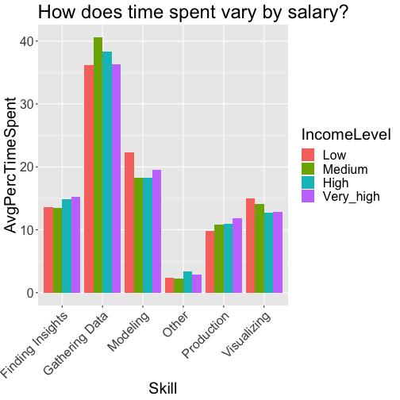
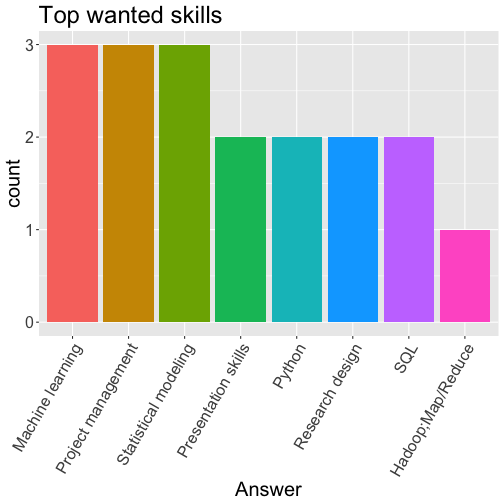
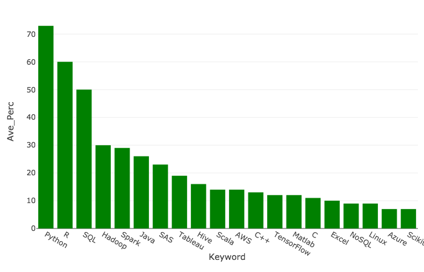

<style>
.small-code pre code {
  font-size: 1em;
}
</style>

The most important data science skills
========================================================
author: Data 607 Project 3, Team EADJ
date: October 25, 2018
autosize: true

Data Sources
========================================================

1. <a href="https://www.kaggle.com/kaggle/kaggle-survey-2017" target="_blank">Kaggle survey</a> (2017), how practitioners work</strong>
  - Sample: 16,000 data science practitioners

2. Custom survey, analytics employers' self-reported hiring needs
  - Sample: Distributed to analytics employers we know using <a href="https://www.surveymonkey.co.uk/r/2GZWJQ6" target="_blank">Survey Monkey</a>, XX responses

3. Published table of terms found in "data scientist" job listings 
  - Sample: Web-scraping & analysis of ~ 15,000 job listings online <a href="https://www.kaggle.com/discdiver/the-most-in-demand-skills-for-data-scientists/" target="_blank">published</a> by author Jeff Hale

1.1 Kaggle, Data Wrangling
========================================================
class:small-code

Very tidy data


```r
glimpse(Kaggle.Multi)
```

```
Observations: 16,716
Variables: 228
$ GenderSelect                                <fct> Non-binary, gender...
$ Country                                     <fct> , United States, C...
$ Age                                         <int> NA, 30, 28, 56, 38...
$ EmploymentStatus                            <fct> Employed full-time...
$ StudentStatus                               <fct> , , , , , , , , , ...
$ LearningDataScience                         <fct> , , , , , , , , , ...
$ CodeWriter                                  <fct> Yes, , , Yes, Yes,...
$ CareerSwitcher                              <fct> , , , , , , , Yes,...
$ CurrentJobTitleSelect                       <fct> DBA/Database Engin...
$ TitleFit                                    <fct> Fine, , , Poorly, ...
$ CurrentEmployerType                         <fct> Employed by a comp...
$ MLToolNextYearSelect                        <fct> SAS Base, Python, ...
$ MLMethodNextYearSelect                      <fct> Random Forests, Ra...
$ LanguageRecommendationSelect                <fct> F#, Python, R, Pyt...
$ PublicDatasetsSelect                        <fct> Dataset aggregator...
$ LearningPlatformSelect                      <fct> College/University...
$ LearningPlatformUsefulnessArxiv             <fct> , , Very useful, ,...
$ LearningPlatformUsefulnessBlogs             <fct> , , , Very useful,...
$ LearningPlatformUsefulnessCollege           <fct> , , Somewhat usefu...
$ LearningPlatformUsefulnessCompany           <fct> , , , , , , , , Ve...
$ LearningPlatformUsefulnessConferences       <fct> Very useful, , , V...
$ LearningPlatformUsefulnessFriends           <fct> , , , Very useful,...
$ LearningPlatformUsefulnessKaggle            <fct> , Somewhat useful,...
$ LearningPlatformUsefulnessNewsletters       <fct> , , , , , , , , Ve...
$ LearningPlatformUsefulnessCommunities       <fct> , , , , , , , , Ve...
$ LearningPlatformUsefulnessDocumentation     <fct> , , , Very useful,...
$ LearningPlatformUsefulnessCourses           <fct> , , Very useful, V...
$ LearningPlatformUsefulnessProjects          <fct> , , , Very useful,...
$ LearningPlatformUsefulnessPodcasts          <fct> Very useful, , , ,...
$ LearningPlatformUsefulnessSO                <fct> , , , , , Very use...
$ LearningPlatformUsefulnessTextbook          <fct> , , , , Somewhat u...
$ LearningPlatformUsefulnessTradeBook         <fct> Somewhat useful, ,...
$ LearningPlatformUsefulnessTutoring          <fct> , , , , , , , , , ...
$ LearningPlatformUsefulnessYouTube           <fct> , , Very useful, ,...
$ BlogsPodcastsNewslettersSelect              <fct> Becoming a Data Sc...
$ LearningDataScienceTime                     <fct> , 1-2 years, 1-2 y...
$ JobSkillImportanceBigData                   <fct> , , Necessary, , ,...
$ JobSkillImportanceDegree                    <fct> , Nice to have, , ...
$ JobSkillImportanceStats                     <fct> , Unnecessary, , ,...
$ JobSkillImportanceEnterpriseTools           <fct> , , , , , , , Nice...
$ JobSkillImportancePython                    <fct> , Unnecessary, , ,...
$ JobSkillImportanceR                         <fct> , , Necessary, , ,...
$ JobSkillImportanceSQL                       <fct> , Necessary, , , ,...
$ JobSkillImportanceKaggleRanking             <fct> , , , , , , , Nice...
$ JobSkillImportanceMOOC                      <fct> , , , , , , , Nice...
$ JobSkillImportanceVisualizations            <fct> , , , , , , , Nice...
$ JobSkillImportanceOtherSelect1              <fct> , , , , , , , , , ...
$ JobSkillImportanceOtherSelect2              <fct> , , , , , , , , , ...
$ JobSkillImportanceOtherSelect3              <fct> , , , , , , , , , ...
$ CoursePlatformSelect                        <fct> , , Coursera,edX, ...
$ HardwarePersonalProjectsSelect              <fct> , , Basic laptop (...
$ TimeSpentStudying                           <fct> , 2 - 10 hours, 2 ...
$ ProveKnowledgeSelect                        <fct> , Master's degree,...
$ DataScienceIdentitySelect                   <fct> Yes, Yes, Yes, Yes...
$ FormalEducation                             <fct> Bachelor's degree,...
$ MajorSelect                                 <fct> Management informa...
$ Tenure                                      <fct> More than 10 years...
$ PastJobTitlesSelect                         <fct> Predictive Modeler...
$ FirstTrainingSelect                         <fct> University courses...
$ LearningCategorySelftTaught                 <dbl> 0, 10, 20, 30, 60,...
$ LearningCategoryOnlineCourses               <dbl> 0, 30, 50, 0, 5, 2...
$ LearningCategoryWork                        <dbl> 100, 0, 0, 40, 5, ...
$ LearningCategoryUniversity                  <dbl> 0, 30, 30, 30, 30,...
$ LearningCategoryKaggle                      <dbl> 0, 30, 0, 0, 0, 10...
$ LearningCategoryOther                       <dbl> 0, 0, 0, 0, 0, 0, ...
$ MLSkillsSelect                              <fct> Computer Vision,Na...
$ MLTechniquesSelect                          <fct> Evolutionary Appro...
$ ParentsEducation                            <fct> A doctoral degree,...
$ EmployerIndustry                            <fct> Internet-based, , ...
$ EmployerSize                                <fct> 100 to 499 employe...
$ EmployerSizeChange                          <fct> Increased slightly...
$ EmployerMLTime                              <fct> 3-5 years, , , , D...
$ EmployerSearchMethod                        <fct> I visited the comp...
$ UniversityImportance                        <fct> Not very important...
$ JobFunctionSelect                           <fct> Build prototypes t...
$ WorkHardwareSelect                          <fct> Gaming Laptop (Lap...
$ WorkDataTypeSelect                          <fct> Text data,Relation...
$ WorkProductionFrequency                     <fct> Rarely, , , Always...
$ WorkDatasetSize                             <fct> 10GB, , , 1GB, 100...
$ WorkAlgorithmsSelect                        <fct> Neural Networks,Ra...
$ WorkToolsSelect                             <fct> Amazon Web service...
$ WorkToolsFrequencyAmazonML                  <fct> , , , Rarely, , , ...
$ WorkToolsFrequencyAWS                       <fct> Rarely, , , Often,...
$ WorkToolsFrequencyAngoss                    <fct> , , , , , , , , , ...
$ WorkToolsFrequencyC                         <fct> , , , , Most of th...
$ WorkToolsFrequencyCloudera                  <fct> , , , Rarely, , , ...
$ WorkToolsFrequencyDataRobot                 <fct> , , , , , , , , , ...
$ WorkToolsFrequencyFlume                     <fct> , , , , , , , , , ...
$ WorkToolsFrequencyGCP                       <fct> , , , , , , , , , ...
$ WorkToolsFrequencyHadoop                    <fct> , , , Rarely, , , ...
$ WorkToolsFrequencyIBMCognos                 <fct> , , , , , , , , , ...
$ WorkToolsFrequencyIBMSPSSModeler            <fct> , , , , , , , , , ...
$ WorkToolsFrequencyIBMSPSSStatistics         <fct> , , , , , , , , , ...
$ WorkToolsFrequencyIBMWatson                 <fct> , , , , , , , , , ...
$ WorkToolsFrequencyImpala                    <fct> , , , Rarely, , , ...
$ WorkToolsFrequencyJava                      <fct> , , , Rarely, , , ...
$ WorkToolsFrequencyJulia                     <fct> , , , , , , , , , ...
$ WorkToolsFrequencyJupyter                   <fct> , , , , Sometimes,...
$ WorkToolsFrequencyKNIMECommercial           <fct> , , , , , , , , , ...
$ WorkToolsFrequencyKNIMEFree                 <fct> , , , , , , , , , ...
$ WorkToolsFrequencyMathematica               <fct> , , , Rarely, , , ...
$ WorkToolsFrequencyMATLAB                    <fct> , , , Rarely, Ofte...
$ WorkToolsFrequencyAzure                     <fct> , , , , , , , , , ...
$ WorkToolsFrequencyExcel                     <fct> , , , Sometimes, ,...
$ WorkToolsFrequencyMicrosoftRServer          <fct> , , , , , , , , , ...
$ WorkToolsFrequencyMicrosoftSQL              <fct> , , , Rarely, , , ...
$ WorkToolsFrequencyMinitab                   <fct> , , , , , , , , , ...
$ WorkToolsFrequencyNoSQL                     <fct> , , , Rarely, , , ...
$ WorkToolsFrequencyOracle                    <fct> Sometimes, , , , ,...
$ WorkToolsFrequencyOrange                    <fct> , , , , , , , , , ...
$ WorkToolsFrequencyPerl                      <fct> Most of the time, ...
$ WorkToolsFrequencyPython                    <fct> , , , Rarely, Some...
$ WorkToolsFrequencyQlik                      <fct> , , , , , , , , , ...
$ WorkToolsFrequencyR                         <fct> , , , Rarely, Some...
$ WorkToolsFrequencyRapidMinerCommercial      <fct> , , , , , , , , , ...
$ WorkToolsFrequencyRapidMinerFree            <fct> , , , , , , , , , ...
$ WorkToolsFrequencySalfrod                   <fct> , , , , , , , , , ...
$ WorkToolsFrequencySAPBusinessObjects        <fct> , , , , , , , , , ...
$ WorkToolsFrequencySASBase                   <fct> , , , Sometimes, ,...
$ WorkToolsFrequencySASEnterprise             <fct> , , , , , , , , , ...
$ WorkToolsFrequencySASJMP                    <fct> , , , Rarely, , , ...
$ WorkToolsFrequencySpark                     <fct> , , , , , , , , , ...
$ WorkToolsFrequencySQL                       <fct> , , , Often, , Oft...
$ WorkToolsFrequencyStan                      <fct> , , , , , , , , , ...
$ WorkToolsFrequencyStatistica                <fct> , , , , , , , , , ...
$ WorkToolsFrequencyTableau                   <fct> , , , Rarely, , , ...
$ WorkToolsFrequencyTensorFlow                <fct> , , , , Sometimes,...
$ WorkToolsFrequencyTIBCO                     <fct> , , , , , , , , , ...
$ WorkToolsFrequencyUnix                      <fct> , , , , , , Most o...
$ WorkToolsFrequencySelect1                   <fct> , , , , , , , , , ...
$ WorkToolsFrequencySelect2                   <fct> , , , , , , , , , ...
$ WorkFrequencySelect3                        <fct> , , , , , , , , , ...
$ WorkMethodsSelect                           <fct> Association Rules,...
$ WorkMethodsFrequencyA.B                     <fct> , , , Sometimes, ,...
$ WorkMethodsFrequencyAssociationRules        <fct> Rarely, , , , Some...
$ WorkMethodsFrequencyBayesian                <fct> , , , Sometimes, O...
$ WorkMethodsFrequencyCNNs                    <fct> , , , , Most of th...
$ WorkMethodsFrequencyCollaborativeFiltering  <fct> Often, , , , Somet...
$ WorkMethodsFrequencyCross.Validation        <fct> , , , , , , Someti...
$ WorkMethodsFrequencyDataVisualization       <fct> , , , Sometimes, M...
$ WorkMethodsFrequencyDecisionTrees           <fct> , , , Often, Somet...
$ WorkMethodsFrequencyEnsembleMethods         <fct> , , , Sometimes, O...
$ WorkMethodsFrequencyEvolutionaryApproaches  <fct> , , , , Sometimes,...
$ WorkMethodsFrequencyGANs                    <fct> , , , , , , , , , ...
$ WorkMethodsFrequencyGBM                     <fct> , , , , , , , , , ...
$ WorkMethodsFrequencyHMMs                    <fct> , , , , , , , , , ...
$ WorkMethodsFrequencyKNN                     <fct> , , , , Most of th...
$ WorkMethodsFrequencyLiftAnalysis            <fct> , , , , , , , , , ...
$ WorkMethodsFrequencyLogisticRegression      <fct> , , , Sometimes, S...
$ WorkMethodsFrequencyMLN                     <fct> , , , Often, , , ,...
$ WorkMethodsFrequencyNaiveBayes              <fct> , , , Sometimes, S...
$ WorkMethodsFrequencyNLP                     <fct> , , , , , , Most o...
$ WorkMethodsFrequencyNeuralNetworks          <fct> Sometimes, , , Som...
$ WorkMethodsFrequencyPCA                     <fct> Often, , , , Somet...
$ WorkMethodsFrequencyPrescriptiveModeling    <fct> , , , , , , , , , ...
$ WorkMethodsFrequencyRandomForests           <fct> Most of the time, ...
$ WorkMethodsFrequencyRecommenderSystems      <fct> , , , , , , , , , ...
$ WorkMethodsFrequencyRNNs                    <fct> , , , , Sometimes,...
$ WorkMethodsFrequencySegmentation            <fct> , , , , Often, , S...
$ WorkMethodsFrequencySimulation              <fct> , , , Often, , , ,...
$ WorkMethodsFrequencySVMs                    <fct> , , , , Most of th...
$ WorkMethodsFrequencyTextAnalysis            <fct> , , , , , , Most o...
$ WorkMethodsFrequencyTimeSeriesAnalysis      <fct> , , , Often, Somet...
$ WorkMethodsFrequencySelect1                 <fct> , , , , , , , , , ...
$ WorkMethodsFrequencySelect2                 <fct> , , , , , , , , , ...
$ WorkMethodsFrequencySelect3                 <fct> , , , , , , , , , ...
$ TimeGatheringData                           <int> 0, NA, NA, 50, 30,...
$ TimeModelBuilding                           <dbl> 100, NA, NA, 20, 2...
$ TimeProduction                              <dbl> 0, NA, NA, 0, 15, ...
$ TimeVisualizing                             <dbl> 0, NA, NA, 10, 15,...
$ TimeFindingInsights                         <dbl> 0, NA, NA, 20, 20,...
$ TimeOtherSelect                             <int> 0, NA, NA, 0, 0, 0...
$ AlgorithmUnderstandingLevel                 <fct> Enough to explain ...
$ WorkChallengesSelect                        <fct> Company politics /...
$ WorkChallengeFrequencyPolitics              <fct> Rarely, , , Often,...
$ WorkChallengeFrequencyUnusedResults         <fct> , , , Often, Somet...
$ WorkChallengeFrequencyUnusefulInstrumenting <fct> , , , Often, , , ,...
$ WorkChallengeFrequencyDeployment            <fct> , , , Often, , , ,...
$ WorkChallengeFrequencyDirtyData             <fct> , , , Often, , Mos...
$ WorkChallengeFrequencyExplaining            <fct> , , , Often, , , ,...
$ WorkChallengeFrequencyPass                  <fct> , , , , , , , , , ...
$ WorkChallengeFrequencyIntegration           <fct> , , , Often, , , ,...
$ WorkChallengeFrequencyTalent                <fct> , , , Often, Somet...
$ WorkChallengeFrequencyDataFunds             <fct> , , , Often, Somet...
$ WorkChallengeFrequencyDomainExpertise       <fct> , , , Most of the ...
$ WorkChallengeFrequencyML                    <fct> , , , Often, , , ,...
$ WorkChallengeFrequencyTools                 <fct> , , , Often, , , ,...
$ WorkChallengeFrequencyExpectations          <fct> , , , Often, , , ,...
$ WorkChallengeFrequencyITCoordination        <fct> , , , , Sometimes,...
$ WorkChallengeFrequencyHiringFunds           <fct> , , , Often, , , ,...
$ WorkChallengeFrequencyPrivacy               <fct> Often, , , Often, ...
$ WorkChallengeFrequencyScaling               <fct> Most of the time, ...
$ WorkChallengeFrequencyEnvironments          <fct> , , , Often, Somet...
$ WorkChallengeFrequencyClarity               <fct> , , , Often, , , ,...
$ WorkChallengeFrequencyDataAccess            <fct> , , , Often, , , ,...
$ WorkChallengeFrequencyOtherSelect           <fct> , , , , , , , , , ...
$ WorkDataVisualizations                      <fct> 26-50% of projects...
$ WorkInternalVsExternalTools                 <fct> Do not know, , , E...
$ WorkMLTeamSeatSelect                        <fct> Standalone Team, ,...
$ WorkDatasets                                <fct> , , , Electricity ...
$ WorkDatasetsChallenge                       <fct> , , , Everything i...
$ WorkDataStorage                             <fct> Document-oriented ...
$ WorkDataSharing                             <fct> Company Developed ...
$ WorkDataSourcing                            <fct> , , , , , , , , , ...
$ WorkCodeSharing                             <fct> Mercurial,Subversi...
$ RemoteWork                                  <fct> Always, , , , Rare...
$ CompensationAmount                          <fct> , , , 250,000, , ,...
$ CompensationCurrency                        <fct> , , , USD, , , , ,...
$ SalaryChange                                <fct> I am not currently...
$ JobSatisfaction                             <fct> 5, , , 10 - Highly...
$ JobSearchResource                           <fct> , , Asking friends...
$ JobHuntTime                                 <fct> , , 1-2, , , , , 1...
$ JobFactorLearning                           <fct> , , Very Important...
$ JobFactorSalary                             <fct> , , Very Important...
$ JobFactorOffice                             <fct> , , Very Important...
$ JobFactorLanguages                          <fct> , , Very Important...
$ JobFactorCommute                            <fct> , , Very Important...
$ JobFactorManagement                         <fct> , , Very Important...
$ JobFactorExperienceLevel                    <fct> , , Very Important...
$ JobFactorDepartment                         <fct> , , Very Important...
$ JobFactorTitle                              <fct> , , Very Important...
$ JobFactorCompanyFunding                     <fct> , , Very Important...
$ JobFactorImpact                             <fct> , , Very Important...
$ JobFactorRemote                             <fct> , , Very Important...
$ JobFactorIndustry                           <fct> , , Very Important...
$ JobFactorLeaderReputation                   <fct> , Somewhat importa...
$ JobFactorDiversity                          <fct> , , Very Important...
$ JobFactorPublishingOpportunity              <fct> , , Very Important...
```

1.1 Kaggle, Data Cleaning
========================================================
class:small-code
Example of data cleaning required

```r
#Limit numeric responses to USD, remove outliers
USD <- Kaggle.Multi %>% 
  mutate(CompensationAmount = as.numeric(as.numeric(levels(CompensationAmount)[CompensationAmount])),
         CompensationAmount = ifelse(CompensationAmount < 100, CompensationAmount*1000, CompensationAmount)) %>%  
  filter(CompensationCurrency=="USD",
         CompensationAmount < 9999999) 
quantile(USD$CompensationAmount, na.rm = TRUE)
```
1.2 Kaggle, Key Findings
========================================================



2.1 Custom Survey, Data Wrangling
========================================================
class:small-code
Adding levels to make unused survey options appear in graphs

```r
#limit data to question 5; drop levels removes unused factors - which are responses to to other questions - will be important later
team_skills <- df_dfs %>%
  filter(df_dfs$Question.No. == 5) %>%
  droplevels()

#add unused answers
levels(team_skills$Answer) <- c(levels(team_skills$Answer),
  "R",
  "Java",
  "Data wrangling", 
  "Unstructured data", 
  "Natural language processing", 
  "Optimization", 
  "Graphical models", 
  "Privacy and ethics", 
  "Other soft skills", 
  "Other (please specify)")
```

2.2 Custom Survey, Key Findings
========================================================


3.1 Job Listings, Data Wrangling
========================================================
class:small-code
Manually entered results of internet search into SQL script to creat table

```
DROP TABLE IF EXISTS `DS_GenSkills`;

CREATE TABLE `DS_GenSkills` (
  `Keyword` varchar(50) DEFAULT NULL,
  `LinkedIn` int(11) DEFAULT NULL,
  `Indeed` int(11) DEFAULT NULL,
  `SimplyHired` int(11) DEFAULT NULL,
  `Monster` int(11) DEFAULT NULL
) ENGINE=InnoDB DEFAULT CHARSET=utf8;

LOCK TABLES `DS_GenSkills` WRITE;
/*!40000 ALTER TABLE `DS_GenSkills` DISABLE KEYS */;

INSERT INTO `DS_GenSkills` (`Keyword`, `LinkedIn`, `Indeed`, `SimplyHired`, `Monster`)
VALUES
	('machine learning',5701,3439,2561,2340),
	('analysis',5168,3500,2668,3306),
	('statistics',4893,2992,2308,2399),
	('computer science',4517,2739,2093,1900),
	('communication',3404,2344,1791,2053),
	('mathematics',2605,1961,1497,1815),
	('visualization',1879,1413,1153,1207),
	('AI composite',1568,1125,811,687),
	('deep learning',1310,979,675,606),
	('NLP composite',1212,910,660,582),
	('software development',732,627,481,784),
	('neural networks',671,485,421,305),
	('project management',476,397,330,348),
	('software engineering',413,295,250,512);

/*!40000 ALTER TABLE `DS_GenSkills` ENABLE KEYS */;
UNLOCK TABLES;
```

3.2 Job Listings, Key Findings
========================================================
  
Python, R, and SQL are all top skills in job postings!




4. Conclusion
========================================================

Lessons Learned

1. Challenges of using MySQL for reproducibility

2. Importance of learning Git for easy collarboration

3. Even tidy-looking data may require a lot of wrangling before performing meaningful analysis!

